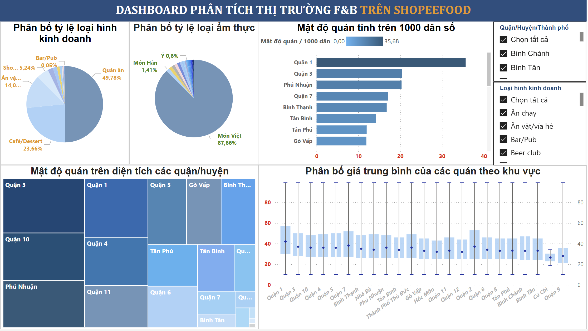
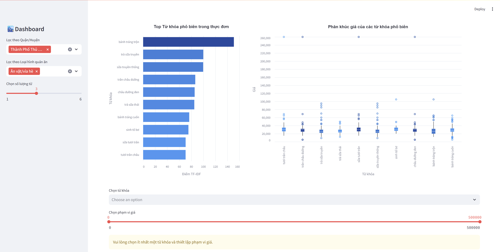
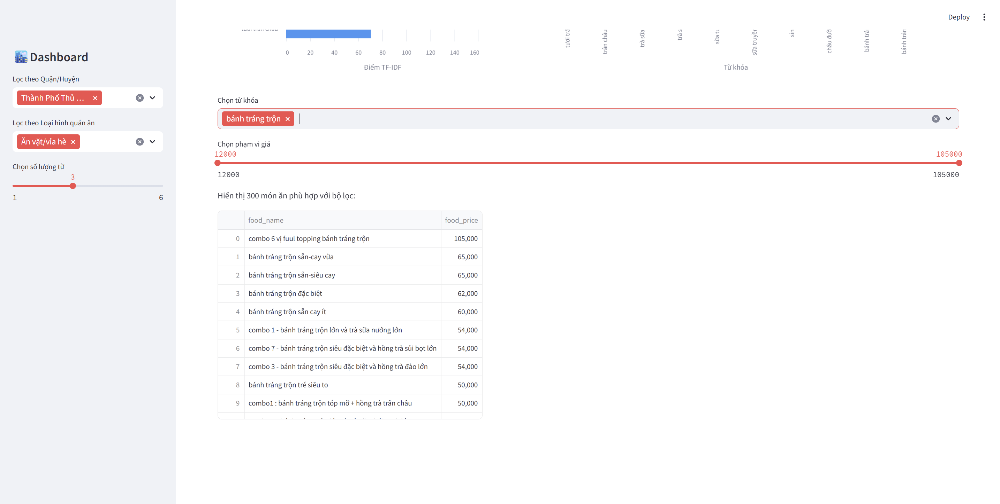

# ShopeeFood-Analysis
- The goal of this project is to provide restaurant owners with meaningful insights into the Food & Beverages market on ShopeeFood.
- This is an end-to-end Data Science project, including collecting, cleaning, modeling, and analyzing data to extract valuable insights.
- The final result provides interactive dashboards for both restaurants and menus.   

## Information
| Student ID | Name                   | Role                                | 
|------------|------------------------|-------------------------------------|
| 21120313   | Trần Nam Phương        | Data Engineer                       |
| 21120324   | Mai Đăng Đức Tài       | Data Engineer                       |
| 21120351   | Nguyễn Thành Trung     | Data Engineer                       |
| 21120475   | Nguyễn Ngọc Như Huyền  | Data Scientist                      |
| 21120496   | Chu Hải Linh           | Data Scientist                      |

## Data
The data was crawled from the ShopeeFood website and stored in a PostgreSQL database to facilitate further analysis.

## Dashboard
### Restaurant dashboard

### Menu dashboard

